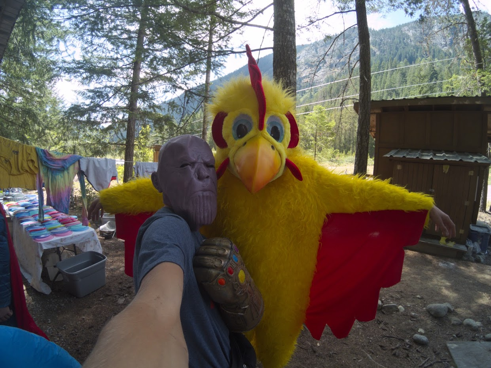

## This is who I am:

### I write code
So, why not checkout out one of my awesome projects?

#### [Line follower with computer vision](https://github.com/graykevinb/Stupid-Eye)
#### [Command line tic-tac-toe](https://github.com/graykevinb/Tic)
#### [Run a script with a physical button on your raspberry pi](https://github.com/graykevinb/Planetary-Start)
#### [Crack the Caesar Cipher](https://github.com/graykevinb/SaladCracker)
#### You can find even more projects on my [github](github.com/graykevinb)

### And I can't not mention robotics.

I was for three years on the frc team [Rockford Robotics](http://rockfordrobotics.com/)
Before that two years on a 4-H team robotics team. And I absolutely loved every minute of it.

### My point? I love computer science!
So, I am going to the Milwaukee School of Engineering. I'm really excited to be honest about using the supercomputer they have.

### I love way more then that too!

Outdoors, swing dance, and Twenty One Pilots just to mention a few.

With diverse interests I"m always learning and happy to meet all people from all cultures and personalities.

### So I volunteered at a summer camp
 I love working with kids, and am willing to anything to make them smile. Even dress up as Thanos. Don't worry though, my ethics are as good as Captain America.
 
 
 
 ### All and all
I'm just about to graduate highschool.So internships, job offers, pro tips, or just a high five are all welcome.
In conclusion here's my email: [kevin.gray.developer@gmail.com](kevin.gray.developer@gmail.com)
